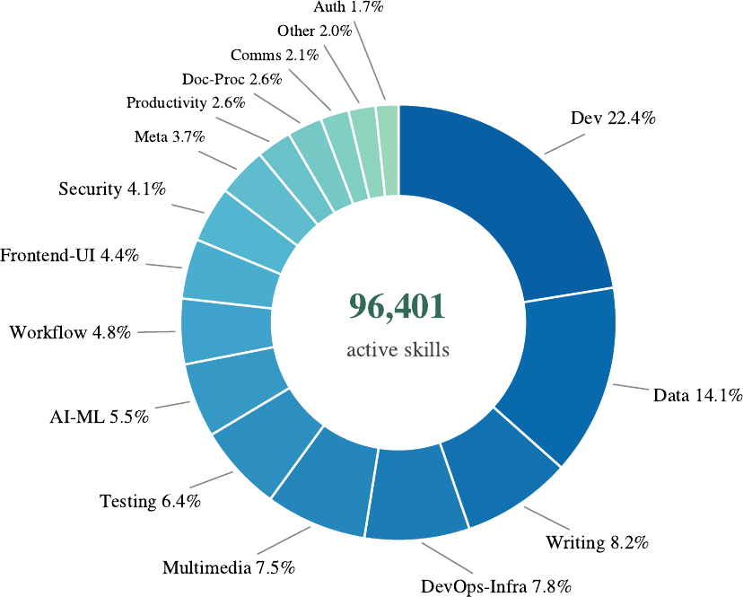
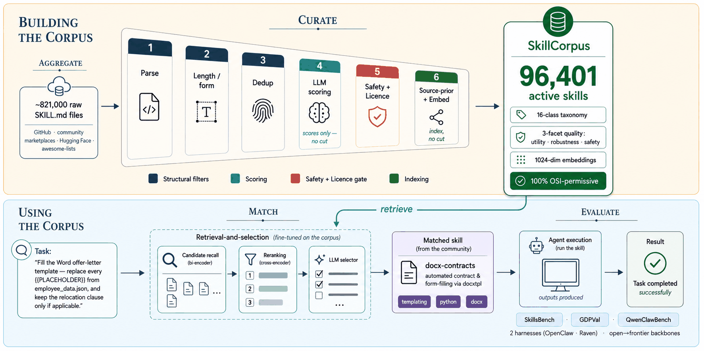

<!-- SkillHub is the live hosted product; this repository contains the open-source corpus,
     retrieval, evaluation, export, and plugin layer behind it. -->

<div align="center" id="readme-top">

<table width="100%" border="1" bordercolor="#d9d9d9" cellspacing="0" cellpadding="0">
<tr><td></td></tr>
</table>

<p align="center">
  <a href="https://huggingface.co/EverMind-AI"></a>
  <a href="https://evermind.ai/skillhub"></a>
  <a href="https://discord.gg/gYep5nQRZJ"></a>
  <a href="https://github.com/EverMind-AI/EverOS/discussions/67"></a>
  <a href="https://arxiv.org/abs/2607.15557"></a>
</p>

<p align="center"><strong>English</strong> · <a href="README.zh-CN.md">简体中文</a></p>


</div>

<br>

## What SkillCorpus gives you

SkillCorpus is EverMind's open-source pipeline for turning scattered `SKILL.md` files from public
repositories into reliable agent context. It aggregates sources, applies safety and license gates,
evaluates quality, and matches task-specific skills before the agent answers.

You can use the live [SkillHub](https://evermind.ai/skillhub) without cloning this repository. Clone
SkillCorpus when you want the open-source machinery behind that experience:

- **Build your own skill layer** — point the pipeline at your own source registry, apply the
  curation, safety, and license gates, and export a corpus for your agents.
- **Change the behavior** — modify the taxonomy, quality and dedup rules, retrieval recipe, export
  schema, evaluation suites, or host plugins.
- **Keep control of deployment** — self-host the released retrieval models and connect your own
  agent host instead of using the hosted SkillHub API.

The core code is Apache-2.0 licensed (`match/` and `evaluate/` are MIT); each skill retains its
upstream license. The public 1,000-skill demo, three agent benchmarks, and live SkillHub show the
result.

https://github.com/user-attachments/assets/4d9a3241-df13-4b20-9798-fb7920069995

<br>

## Stronger agents, one turn at a time

At answer time, the practical difference is a retrieval layer: SkillHub selects vetted procedural
knowledge for the task and puts it into the agent's context.

<table width="100%">
<tr>
<th>Dimension</th>
<th>Without SkillCorpus</th>
<th>With SkillCorpus</th>
</tr>
<tr>
<td><strong>Context</strong></td>
<td>Model knowledge plus a manually maintained prompt.</td>
<td>Task-specific, license-audited <code>SKILL.md</code> retrieved on every turn.</td>
</tr>
<tr>
<td><strong>Execution</strong></td>
<td>Generic workflows can miss exact steps, edge cases, or supporting scripts.</td>
<td>Procedures, references, and optional scripts arrive before execution.</td>
</tr>
<tr>
<td><strong>Integration</strong></td>
<td>Each host maintains its own collection of task instructions.</td>
<td>One curated skill layer serves OpenClaw, Hermes, Raven, WorkBuddy, DeepSeek Harness, and other hosts.</td>
</tr>
</table>

The result is the same agent with better task-specific procedures available at the moment it needs
them — stronger execution without asking users to memorise skill names or wire up tool calls.

<br>

## Results

Pass rate with no skills → with SkillCorpus, same harness, same backbone
([paper, Table 1](https://arxiv.org/abs/2607.15557)):

| Harness × backbone | SkillsBench | GDPVal | QwenClawBench |
|---|---|---|---|
| OpenClaw × Qwen3.5-27B | 8.8 → **13.0** | 81.2 → **83.1** | 65.2 → **66.7** |
| OpenClaw × Qwen3.5-397B | 11.1 → **16.9** | 82.2 → **84.0** | 65.7 → **67.0** |
| Raven × Qwen3.5-27B | 10.0 → **16.5** | 82.6 → **83.8** | 66.9 → **70.8** |
| Raven × Qwen3.5-397B | 9.2 → **22.6** | 84.0 → **85.2** | 68.8 → **73.2** |
| **Pooled ∆** | **+7.5**±2.3 (z=3.2) | **+1.51**±0.49 (z=3.1) | **+2.79**±0.70 (z=4.0) |

The gain is largest where the task needs procedural knowledge the model does not already have
(SkillsBench), and smallest on open-ended economic tasks it can already do (GDPVal).

<br>

## SkillHub integrations

SkillHub brings per-turn skill retrieval to the five agent platforms below. Choose a platform to open its
plugin guide:

<table width="100%">
<tr>
<td width="400" align="center"><a href="skillcorpus_plugin/engine-typescript/README.md"><br><strong>DeepSeek Harness</strong></a></td>
<td width="400" align="center"><a href="skillcorpus_plugin/plugin-hermes/README.md"><br><strong>Hermes</strong></a></td>
<td width="400" align="center"><a href="skillcorpus_plugin/plugin-openclaw/README.md"><br><strong>OpenClaw</strong></a></td>
<td width="400" align="center"><a href="skillcorpus_plugin/plugin-raven/README.md"><br><strong>Raven</strong></a></td>
<td width="400" align="center"><a href="skillcorpus_plugin/plugin-workbuddy/README.md"><br><strong>WorkBuddy</strong></a></td>
</tr>
</table>

Retrieval runs every turn, before the model answers: no tool call, no skill names to memorise,
no host patch. The packaged Raven plugin is ready to install, but it will claim the `skills`
stage once Raven merges its upstream `context_segments` slot; Raven's built-in retrieval keeps
working today.

> Install SkillCorpus Plugins following https://github.com/EverMind-AI/SkillCorpus/blob/main/skillcorpus_plugin/INSTALL.agent.md

Paste that line to your agent and it installs itself. Per-host setup, the five settings you
will actually touch, what each turn costs and what leaves your machine —
**[`skillcorpus_plugin/`](skillcorpus_plugin)**.

<br>

## Public artifacts

This is the concrete inventory of what is public today.

| | Artifact | What | Link |
|---|---|---|---|
| 🌐 | **SkillHub** | the current 114,190-skill catalog + the two models, hosted as an API — no install | [evermind.ai/skillhub](https://evermind.ai/skillhub) |
| 📚 | **Corpus** *(demo)* | the downloadable 1,000-skill sample — `skills.parquet` + `attachments.tar.zst` + dataset card; the full catalog is served by SkillHub | [🤗 demo-1k](https://huggingface.co/datasets/EverMind-AI/skillcorpus-demo-1k) |
| 🔡 | **Retrieval models** | a bi-encoder and a reranker, fine-tuned from `Qwen3-Embedding-0.6B` and `Qwen3-Reranker-0.6B` | [🤗 bi-encoder](https://huggingface.co/EverMind-AI/skillcorpus-embedding-0.6b) · [reranker](https://huggingface.co/EverMind-AI/skillcorpus-reranker-0.6b) |
| 🛠️ | **Code** | this repo — the pipeline that builds the corpus and trains the two models (`aggregate` · `curate` · `match` · `evaluate` · `export`) | [GitHub](https://github.com/EverMind-AI/SkillCorpus) |
| 🔌 | **Plugins** | packaged host adapters for OpenClaw · Hermes · WorkBuddy · Raven, plus DeepSeek Harness and an HTTP adapter | [`skillcorpus_plugin/`](skillcorpus_plugin) |

*Open source today: the code, 1,000-skill demo corpus, and retrieval models. The hosted SkillHub
service is closed, and the full hosted catalog is not yet published as a downloadable dataset.*

<div align="center">

</div>

The 96,401-skill snapshot measured in the paper, organised by a 16-class taxonomy and three quality facets
(utility / robustness / safety), with 1024-dim retrieval embeddings. Column contract:
[`docs/corpus-schema.md`](docs/corpus-schema.md).

<br>

## Query the API directly

[SkillHub](https://evermind.ai/skillhub) serves the corpus in three tiers — discover
(metadata), read (`skill_md`), download (zip with `scripts/`). Most skills are pure
instructions, so the read tier is usually sufficient.

```bash
curl "https://skillhub.evermind.ai/openapi/v1/skills?q=extract+tables+from+a+PDF"
```

Take an `id` from the results, fetch its `skill_md`, and inject it into your agent's
prompt. [`examples/skillhub_demo.py`](examples/skillhub_demo.py) runs all three tiers:

```bash
# search + read the bodies — stdlib only, no install, no API key
python examples/skillhub_demo.py "extract tables from a scanned PDF invoice"

# also fetch the bundled scripts of the top hit
python examples/skillhub_demo.py --install ./skills "convert a PDF to images"

# retrieve AND run the task — any OpenAI-compatible LLM (OpenAI, OpenRouter, local vLLM, …)
export OPENAI_API_KEY=...                                # OpenRouter / vLLM: also set
# export OPENAI_BASE_URL=https://openrouter.ai/api/v1   # OPENAI_BASE_URL + --model openai/gpt-4o-mini
python examples/skillhub_demo.py --ask "extract tables from a scanned PDF invoice"
```

```
task: extract tables from a scanned PDF invoice

[1/2] search  → 2 hit(s), metadata only
  1. ocr-and-documents   q=0.808  DOC-PROC  MIT
     Extract text from PDFs/scans (pymupdf, marker-pdf).
  2. document-workflows  q=0.86   DOC-PROC  MIT
     Build end-to-end document processing workflows and pipelines …

[2/2] detail  → fetching skill_md for 2 skill(s)
  ocr-and-documents: 4916 chars  u=8 r=7 s=9  files=4  flags=['no_steps']
  document-workflows: 31628 chars  u=9 r=9 s=9  files=7

→ built a prompt of 36,742 chars with the skill bodies injected
```

Endpoints, response envelope, status codes and rate limits:
[`docs/integrations.md`](docs/integrations.md).

<br>

## Self-host the models

To avoid depending on the hosted endpoint, run selection yourself. The corpus and both
retrieval models are released: load the data, serve the two models, and run your own
encode → top-k → rerank.

```python
# the data — a 1,000-skill demo for now; the full 114,190-skill corpus follows
from datasets import load_dataset
skills = load_dataset("EverMind-AI/skillcorpus-demo-1k", split="train")   # 1,000 demo skills
# or read the file directly with pandas (no `datasets`):  pip install pandas
import pandas as pd; skills = pd.read_parquet("skills.parquet")
```

Attachments (`scripts/`, `references/`) ship as a sibling `attachments.tar.zst`.

```bash
# install the serving deps (torch, transformers, …), then point the two env vars at
# the released checkpoints (the script's defaults are training outputs absent from a
# fresh clone) and serve both models behind one endpoint  ->  /embed + /score
pip install -r skillcorpus/match/requirements.txt
EMBEDDING_MODEL=<embedding checkpoint dir> RERANKER_MODEL=<reranker checkpoint dir> \
  bash skillcorpus/match/scripts/run_server.sh
```

This endpoint speaks `/embed` + `/score`
([`skillcorpus/match/` → Serving](skillcorpus/match/README.md#serving)) — it is **not** a
drop-in for SkillHub's hosted-only `/openapi/v1/skills` API. So:

- `examples/skillhub_demo.py` and the section-C integrations talk only to the **hosted**
  SkillHub; a self-hosted setup runs its own selection directly over `/embed` + `/score`.
- It is also the embedding endpoint the producer's dedup uses — set
  `embedding.provider: skillrouter_remote` to [build your own corpus](#build-your-own) with it.

To curate **your own** sources instead, see [Build your own corpus](#build-your-own).

<br>

## How it works

<div align="center">

<p><em>The collection pipeline is the foundation; the payoff is task-specific skill retrieval before the agent acts.</em></p>
</div>

```
skillcorpus/
├── core/       data models · SQLite/faiss store · LLM & embedding clients
├── aggregate/  source registry + multi-repo clone
├── curate/     parse · safety · license · classify · quality · dedup + full-library passes
├── export/     corpus writer (parquet + attachments + dataset card)
├── match/      the 2 released models + training recipe                 ← isolated deps
├── evaluate/   skillsbench · qwenclawbench · gdpval benchmarks          ← isolated deps
└── cli.py      build · stats · export
```

`cli build` runs the whole curation chain
(`ingest → quality_pass → dedup_pass → license_audit → export.corpus`). LLM classification and
quality scoring degrade gracefully to rules when no model endpoint is reachable, so the pipeline
always runs end to end.

`match/` and `evaluate/` are standalone toolkits with their own `requirements.txt`
(torch / transformers, per benchmark); they are **not** pulled in by `pip install` of the producer.

- **Retrieval** — [`skillcorpus/match/`](skillcorpus/match) is **the two released models**:
  a bi-encoder fine-tuned from `Qwen3-Embedding-0.6B` for candidate recall, and a reranker
  fine-tuned from `Qwen3-Reranker-0.6B` that scores the top candidates. SkillHub serves both;
  to run them yourself see [Serving](skillcorpus/match/README.md#serving) (`serve.py` +
  `run_server.sh`). The directory also holds the training
  recipe (synthetic queries → InfoNCE → listwise CE) and `eval_compare.py` for the retrieval
  metrics (nDCG / MRR / Hit / Recall).
- **Benchmarks** — [`skillcorpus/evaluate/`](skillcorpus/evaluate): `skillsbench`,
  `qwenclawbench`, `gdpval` — each self-contained with its own README and dependencies.

<a name="build-your-own"></a>

<br>

## Build your own corpus

Only needed if you want to curate **your own** sources. Requires an LLM endpoint for
classification / quality scoring and an embedding endpoint for dedup — see
[`docs/running.md`](docs/running.md).

```bash
git clone https://github.com/EverMind-AI/SkillCorpus.git skillcorpus && cd skillcorpus
python3 -m venv .venv && source .venv/bin/activate
python -m pip install --upgrade pip && pip install -e .

python -m skillcorpus.cli build     # 4 demo sources -> curate -> export
python -m skillcorpus.cli stats     # counts by source / category / license
python -m skillcorpus.cli export --out ./corpus
```

Only skills from GREEN-licensed **sources** are exported (the demo trusts the whitelist in
`audit/license_safe_sources.json` wholesale; production gates per source-repo SPDX). The per-row
`license` is each skill's declared value, so a demo corpus can still carry non-GREEN `license`
strings. Use `--sources-config your.yaml` for your own registry, or `--source <name>` for one source.

```bash
pip install -e ".[dev]"
python -m pytest skillcorpus/tests -p no:cacheprovider --import-mode=importlib
```

<br>

## Roadmap

<!-- TODO(@team): this is a first pass from known gaps — edit to match your plan. -->

- [x] Curation pipeline: 16-class taxonomy, 3-facet quality, per-source license audit
- [x] Fine-tuned retrieval stack + three-benchmark evaluation
- [x] Public SkillHub endpoint
- [x] Retrieval models (bi-encoder + reranker) and a 1k demo corpus on HuggingFace
- [ ] Full 114,190-skill corpus on HuggingFace
- [x] Deployment script for the two retrieval models (self-hosting `match/`)
- [x] Plugins for WorkBuddy · Hermes · OpenClaw · DeepSeek Harness (+ HTTP adapter for any other host)
- [ ] Raven plugin — packaged, waiting on the upstream `context_segments` slot

<br>

## EverMind Ecosystem

EverMind is an open-source ecosystem for long-term memory, self-evolving agents, AI-native interfaces, and memory evaluation.

<table>
<tr>
<th colspan="2">EverMind Open-Source Ecosystem</th>
</tr>
<tr>
<td><strong>Memory Runtime</strong></td>
<td><a href="https://github.com/EverMind-AI/EverOS">EverOS</a> — the local memory operating system and research-backed runtime for agent and user memory.</td>
</tr>
<tr>
<td><strong>Self-Improving Agent Harness</strong></td>
<td><a href="https://github.com/EverMind-AI/Raven">Raven</a> — the self-improving agent harness that brings memory, proactivity, context control, and skill evolution into terminal-native agents.</td>
</tr>
<tr>
<td><strong>Agent Skills &amp; Retrieval</strong></td>
<td><a href="https://github.com/EverMind-AI/SkillCorpus">SkillCorpus</a> — open curation and retrieval tooling, a public <a href="https://huggingface.co/datasets/EverMind-AI/skillcorpus-demo-1k">1K demo corpus</a>, <a href="https://evermind.ai/skillhub">SkillHub</a>, agent integrations, and benchmarks.</td>
</tr>
<tr>
<td><strong>Algorithm Engine</strong></td>
<td><a href="https://github.com/EverMind-AI/EverAlgo">EverAlgo</a> — stateless extraction, ranking, parsing, and memory operators that power EverOS.</td>
</tr>
<tr>
<td><strong>Hypergraph Memory</strong></td>
<td><a href="https://github.com/EverMind-AI/HyperMem">HyperMem</a> — hypergraph memory for long-term conversations, with its own benchmark-backed topic → episode → fact retrieval method.</td>
</tr>
<tr>
<td><strong>Benchmarks</strong></td>
<td><a href="https://github.com/EverMind-AI/EverMemBench">EverMemBench</a> · <a href="https://github.com/EverMind-AI/EvoAgentBench">EvoAgentBench</a> — evaluation suites for conversational memory and agent self-evolution.</td>
</tr>
<tr>
<td><strong>Long-Context Research</strong></td>
<td><a href="https://github.com/EverMind-AI/MSA">MSA</a> — Memory Sparse Attention for scalable latent memory and 100M-token contexts.</td>
</tr>
<tr>
<td><strong>Personal Memory Layer</strong></td>
<td><a href="https://github.com/EverMind-AI/EverMe">EverMe</a> — CLI and agent plugin suite for cross-device, cross-agent personal memory.</td>
</tr>
<tr>
<td><strong>Developer Integrations</strong></td>
<td><a href="https://github.com/EverMind-AI/evermem-claude-code">evermem-claude-code</a> · <a href="https://github.com/EverMind-AI/everos-plugins">everos-plugins</a> — plugins, skills, and migration tooling for AI coding agents.</td>
</tr>
</table>

Together, these repositories form EverMind's research-to-runtime stack: new memory methods, reusable algorithms, benchmark evidence, and practical agent integrations.

<br>

## Citation

```bibtex
@article{wang2026skillcorpus,
  title         = {SkillCorpus: Consolidating and Evaluating the Open Skill Ecosystem for Real-World LLM Agents},
  author        = {Wang, Yanze and Yao, Pengfei and Sun, Tianyi and Hu, Chuanrui and Xiao, Yan and Luo, Xiaotian and Han, Yunyun and Chen, Yifan and Sun, Jun and Deng, Yafeng},
  year          = {2026},
  eprint        = {2607.15557},
  archivePrefix = {arXiv},
  url           = {https://arxiv.org/abs/2607.15557}
}
```

<br>

## License

- **Code** — Apache-2.0 (the `match/` and `evaluate/` toolkits are each MIT — see their own `LICENSE`).
- **Corpus** — every skill keeps its **original upstream license**; only GREEN
  (MIT / Apache-2.0 / BSD / ISC / …) skills are included, none relicensed. Each row carries
  `source`, `source_url`, and `license`, so downstream use must follow the per-skill terms.

Full GREEN/RED/YELLOW policy, license data flow, and opt-out:
[`docs/licence-and-governance.md`](docs/licence-and-governance.md).
